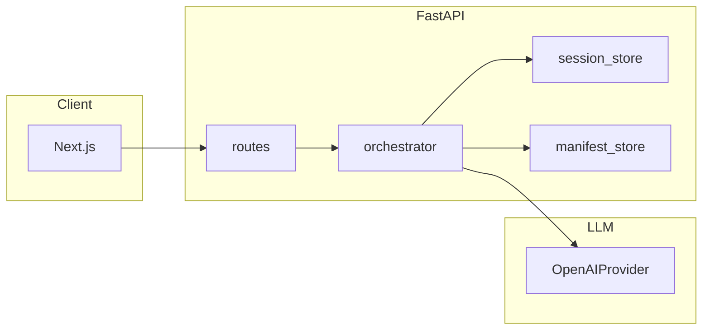

# Career Counsel AI Backend

이 백엔드는 **학생부·내신·모의고사(및 수능) 성적**, **지원 선호**, **공개 모집결과 데이터**를 연결해 추천 요약과 후속 상담형 답변을 제공하는 **FastAPI 기반 입시 상담 API**입니다. 단순 텍스트 생성보다 **원본 파일에 근거한 설명**을 우선하도록 설계했으며, 사람이 최종 검토할 수 있는 초안과 비교 포인트를 빠르게 만드는 데 초점을 둡니다.

## 핵심 역할

- 구조화된 인테이크 응답을 저장하고 다음 질문 흐름을 관리
- `Data/` 아래 모집결과·요강 원본을 ingestion해 카탈로그 생성
- OpenAI Responses API와 파일 입력을 이용한 추천 요약 생성
- 세션 기반 후속 질문 처리
- 게스트 쿠키 기준 무료 사용량 추적

인테이크(초기 질문)는 무료이며, 턴 차감은 **최초 추천 요약 생성 시점**부터 시작됩니다. 이후 후속 질문도 같은 세션 흐름에서 집계됩니다.

## 프로젝트 구조

- `backend/`: FastAPI 앱 본체
- `frontend/`: Next.js App Router 프론트엔드
- `Data/`: 모집결과·요강 원본
- `storage/`: 카탈로그, parquet, 세션, 캐시 등 재생성 가능한 런타임 산출물

## 아키텍처와 설계 이유

### 요청 흐름(개념)



- **라우터는 얇게 유지:** HTTP 검증·DI만 담당하고, 상담 단계 전이·파일 후보 선정·LLM 호출·트레이스 기록은 **`orchestrator`** 에 모읍니다. 엔드포인트가 늘어나도 규칙이 한곳에 남아 테스트와 유지보수가 쉬워집니다.

### 인제스션 파이프라인을 두는 이유

- **목적:** `Data/`의 스프레드시트를 **안정적으로 읽어** `manifest.json`과 시트 단위 **parquet**으로 옮깁니다. 매 요청마다 원본 xlsx를 처음부터 해석시키는 것보다, 서버가 한 번 정규화해 두는 편이 재현성과 디버깅 측면에서 유리합니다.
- **스냅샷·해시:** 파일 내용이 같으면 스킵하는 식으로 **멱등성**을 두어, 대용량 폴더를 여러 번 돌려도 불필요한 중복 쓰기를 줄입니다.
- **PDF를 직접 구조화하지 않는 이유:** PDF에서 표를 안정적으로 뽑아 parquet로 만드는 일은 별도 추출기와 레이아웃 처리가 필요하고 실패 모드가 많습니다. 대신 OpenAI Responses의 `input_file` 경로를 활용해, **카탈로그용 정규화는 스프레드시트**, **추천 시점 원문 참조는 PDF**로 책임을 분리했습니다.

### 카탈로그 + 디스크 재스캔을 함께 쓰는 이유

- 카탈로그에 아직 반영되지 않은 파일이 `Data/`에만 있을 수 있습니다. 추천이 항상 최신 폴더 상태를 보도록, 디스크를 한 번 더 훑어 **고아 파일**을 후보에 넣습니다.
- 반대로 manifest에 있는 경로가 삭제된 경우는 후보 생성 시 `exists()`로 걸러집니다.

### 지역 필터(`region_hints`, `admissions_files`)를 이렇게 만든 이유

- 사용자는 "영남권"처럼 **광역 단위**를 고르지만, 원본 데이터는 `경상북도`, `경산시`, `대구대학교`처럼 서로 다른 표기가 섞여 있습니다. 단순 부분 문자열 매칭만으로는 행정구역명 불일치 때문에 파일이 빠지거나, 실패 시 전체 파일을 다시 노출하는 문제가 생깁니다.
- 그래서 **(1) 행정 표기 정규화**, **(2) 시·군 폴더명 → 짧은 도 토큰**, **(3) 경로에 `영남권` 같은 매크로 폴더가 있으면 토큰 확장**을 한 뒤, 하나의 “검색용 문자열”에서 매칭합니다. 이는 별도 DB 없이도 **파일 경로만으로 지역 의도를 추론**하게 하려는 타협입니다(정밀도가 더 필요하면 대학–시도 매핑 DB를 추가하는 편이 좋습니다).

### 엑셀 우선 dedupe + `structured_input_tier`의 이유

- 같은 연도·같은 수시/정시에 **엑셀과 PDF가 동시에 있으면** 내용이 사실상 중복인 경우가 많습니다. 둘 다 올리면 비용·지연·혼선이 커집니다.
- OpenAI 쪽에서 스프레드시트는 **시트 단위로 행 수를 제한·요약하는 처리**가 들어가는 반면, PDF는 **텍스트 + 페이지 이미지**가 들어가 토큰이 불리한 경우가 많습니다. 그래서 **동일 묶음에서는 스프레드시트만 남기고 PDF는 제외**하며, 상한으로 자를 때도 **스프레드시트를 더 높은 우선순위**로 둡니다. PDF만 있는 학교는 그대로 PDF를 씁니다.

### OpenAI 파일 캐시(해시 → `file_id`)를 쓰는 이유

- 동일 파일을 매 세션마다 다시 업로드하면 시간·비용·레이트 리스크가 커집니다. SHA-256 해시가 같으면 기존 `file_id`를 재사용합니다.

### `OpenAIProvider`와 `LLMProvider` 인터페이스

- 추천·후속 답변·배치 합성 등에서 같은 추상 타입으로 호출할 수 있게 `LLMProvider`를 두고, 현재 구현체는 **OpenAI만** 둡니다. 나중에 다른 제공자를 붙일 때 오케스트레이터 변경을 최소화하려는 의도입니다.

### 구조화 출력(파싱된 요약 스키마)을 쓰는 이유

- 자유 텍스트만 받으면 프론트가 추천 카드로 쓰기 어렵고, 후처리 파싱도 쉽게 깨집니다. 구조화 출력을 쓰면 **필드 단위 검증**, **빈 추천 재시도**, **일관된 응답 스키마 유지**가 가능합니다.

### 배치 합성(`openai_file_batch_size`)

- 후보 파일이 많을 때 한 번에 올리면 한도와 타임아웃에 걸리기 쉽습니다. 그래서 배치로 나눠 요약한 뒤 서버에서 다시 합성하는 경로를 둡니다.

### 웹 검색을 켜 둔 이유(옵션)

- 모집결과 파일만으로는 부족한 **기숙사·등록금·학사일정** 같은 "살아 있는 정보"는 공식 사이트가 더 정확한 경우가 많습니다. 그래서 질문 유형에 따라 웹 보강을 켤 수 있게 했습니다.

---

아래부터는 실행, 환경 변수, 배포 절차를 정리합니다.

## Windows: 원클릭 시작 / 종료

저장소 루트(`backend`와 `frontend`가 있는 폴더)에서:

- **`start-dev.bat`**을 더블클릭하면 창이 두 개 열립니다: API(`:8000`), 웹(`:3000`).
- **`stop-dev.bat`**을 더블클릭하면 포트 **8000**과 **3000**에서 대기 중인 프로세스를 종료합니다.

최초 설정은 `backend/`에서 `python -m pip install -e ".[dev]"`, `frontend/`에서 `npm install`이 여전히 필요합니다.

## 빠른 시작

```bash
cd backend
python -m pip install -e ".[dev]"
uvicorn app.main:app --reload
```

### OpenAI 타임아웃

입시 요약은 Responses API에 여러 파일을 올리고 추론까지 수행하므로 **1분 이상** 걸릴 수 있습니다. `COUNSEL_REQUEST_TIMEOUT_SECONDS`만으로는 `ReadTimeout` / `APITimeoutError`가 날 수 있으므로, Responses용으로는 **`COUNSEL_OPENAI_RESPONSES_TIMEOUT_SECONDS`(기본 900초)** 를 별도로 두었습니다.

### 추천 요약(`/complete`)·후속 답변(`/message`)과 `--reload`

`POST /api/v1/chat/session/{session_id}/complete`는 **백그라운드 작업**으로 처리됩니다. **HTTP 202**로 먼저 응답한 뒤, 클라이언트는 세션을 폴링하거나 완료 후 같은 엔드포인트를 다시 호출해 **200**과 전체 요약 본문을 받습니다.

`POST /api/v1/chat/session/{session_id}/message`도 동일하게 **백그라운드 작업**으로 처리될 수 있습니다. 같은 `client_request_id`로 다시 호출하면, 진행 중이면 **202**, 완료되었으면 **200**과 후속 답변 본문을 돌려받습니다.

파일 업로드와 모델 추론 때문에 수 분이 걸릴 수 있으며, API 키·네트워크·모델 오류가 나면 오케스트레이터는 로그를 남기고 결정적 요약 등으로 폴백할 수 있습니다.

- **`--reload`를 켠 상태**에서는 파일이 바뀔 때마다 워커가 재시작되어 긴 작업이 끊길 수 있습니다. 추천 요약을 안정적으로 돌려보려면 `uvicorn app.main:app`(reload 없이) 실행을 권장합니다.
- **프로덕션**에서는 일반적으로 reload를 사용하지 않습니다.

기본 백엔드 URL:

- `http://127.0.0.1:8000`

## 프론트엔드 연동 주의

```bash
cd frontend
npm install
npm run dev
```

기본 프론트엔드 URL:

- `http://127.0.0.1:3000`

로컬 개발 시 **`NEXT_PUBLIC_API_BASE_URL`은 비워 두세요**(`frontend/.env.local.example` 참고). Next.js 개발 서버가 `/api/v1/*`를 FastAPI(`BACKEND_INTERNAL_URL`, 기본값 `http://127.0.0.1:8000`)로 리라이트하므로 쿠키가 페이지와 같은 사이트(예: `localhost:3000`)에 유지됩니다. 앱을 `http://localhost:3000`으로 열어두고 `NEXT_PUBLIC_API_BASE_URL`을 `http://127.0.0.1:8000`으로 두면 게스트 쿠키가 전송되지 않아 세션 로드가 실패할 수 있습니다.

의도적으로 다른 오리진에서 API를 호출하고 CORS/쿠키 설정이 맞을 때만 전체 `NEXT_PUBLIC_API_BASE_URL`을 설정하세요.

## 외부 접속

기본값은 `127.0.0.1`(루프백)만 듣기 때문에 **같은 PC**에서만 접속됩니다. 다른 기기·인터넷에서 쓰려면 아래 중 상황에 맞는 방법을 씁니다.

### LAN(같은 Wi-Fi 등)에서 접속

1. **백엔드**가 모든 네트워크 인터페이스에서 accept 하도록 실행합니다.

```bash
cd backend
uvicorn app.main:app --reload --host 0.0.0.0 --port 8000
```

2. **프론트**(개발 서버)도 바깥에서 들어오는 연결을 받게 합니다.

```bash
cd frontend
npm run dev -- --hostname 0.0.0.0 --port 3000
```

3. 서버 PC의 **LAN IP**로 접속합니다(예: `http://192.168.0.12:3000`). `ipconfig`(Windows) / `ip a` 또는 `hostname -I`(Linux)로 주소를 확인합니다.

4. **백엔드 `.env`**에서 브라우저에 보이는 주소와 맞춥니다.  
   - `COUNSEL_FRONTEND_APP_URL=http://192.168.0.12:3000`  
   - `COUNSEL_API_CORS_ORIGINS`에 동일한 오리진을 포함합니다(쉼표로 여러 개 가능). 예: `http://192.168.0.12:3000`

5. **프론트 `frontend/.env.local`**에서 휴대폰 등으로 접속할 때 Next dev HMR 차단 경고를 없애려면, 접속에 쓰는 **호스트만** 콤마로 넣습니다. 예: `NEXT_ALLOWED_DEV_ORIGINS=192.168.0.12` (프로토콜 없이 IP 또는 호스트명). 개발 서버를 다시 띄웁니다.

6. **`NEXT_PUBLIC_API_BASE_URL`은 비운 채** 두면, 다른 기기의 브라우저는 `http://192.168.x.x:3000`으로만 요청하고 Next가 서버 쪽에서 `BACKEND_INTERNAL_URL`(기본 `http://127.0.0.1:8000`)로 백엔드에 붙습니다. 백엔드를 **다른 머신**에 둔 경우에만 `BACKEND_INTERNAL_URL`을 그 머신의 내부 주소로 바꿉니다.

7. **OS 방화벽**에서 TCP **3000**, **8000** 인바운드를 허용합니다.  
   - Windows: “고급 보안이 포함 Windows Defender 방화벽” → 인바운드 규칙 → 새 규칙(포트).  
   - Ubuntu 등: `sudo ufw allow 3000/tcp` 및 `sudo ufw allow 8000/tcp` 후 `sudo ufw reload`.

### 인터넷(공인 IP·도메인)으로 열기

- **집/사무실 공유기 뒤**라면 공유기 관리 페이지에서 **포트 포워딩**(WAN → 서버 PC의 3000 또는 역프록시용 80/443)을 설정하고, 위와 같이 `COUNSEL_FRONTEND_APP_URL`·`COUNSEL_API_CORS_ORIGINS`를 **`http://공인IP:포트` 또는 `https://도메인`**으로 맞춥니다. HTTP로 노출하는 것은 비밀번호·쿠키 탈취 위험이 있으므로 **가능하면 HTTPS + 도메인**을 쓰세요.
- **본격 운영**은 아래 [Linux: 프로덕션 호스팅](#linux-프로덕션-호스팅)처럼 Nginx(또는 Caddy)로 443을 받고 앱은 `127.0.0.1`에만 바인딩하는 방식이 안전합니다.
- **데모·잠깐 공유**만 필요하면 [Cloudflare Tunnel](https://developers.cloudflare.com/cloudflare-one/connections/connect-networks/)·[ngrok](https://ngrok.com/) 등으로 로컬 서비스를 터널링하는 방법이 포트 개방 없이 간단합니다.

### 프로덕션에서의 외부 접속

인터넷 사용자에게 서비스하려면 **도메인 + 80/443 + 역프록시** 구성이 일반적입니다. 절차·systemd·Nginx 예시는 [Linux: 프로덕션 호스팅](#linux-프로덕션-호스팅)을 따르고, DNS A/AAAA 레코드를 서버 공인 IP에 연결하면 됩니다.

## Linux: 프로덕션 호스팅

배포 시에도 **저장소 루트**에 `backend/`, `frontend/`, `Data/`, `storage/`가 함께 있어야 합니다. 백엔드의 `project_root`는 `backend` 폴더의 상위(저장소 루트)로 잡히므로, `Data/`·`storage/`를 다른 위치만 쓰려면 `COUNSEL_DATA_ROOT`, `COUNSEL_STORAGE_ROOT`로 절대 경로를 지정하세요.

### 1. 준비물

- Python **3.12+**, Node.js **20.9+**(LTS 권장), `npm` 또는 `pnpm`
- 방화벽에서 **80/443**(역프록시 사용 시)만 공개하고, 앱은 `127.0.0.1`에 바인딩하는 구성을 권장합니다.
- HTTPS(Let’s Encrypt 등)와 실제 도메인 — 외부 공개 운영 시 쿠키 보안을 위해 권장합니다.

### 2. 의존성 설치

```bash
cd /path/to/repo/backend
python3.12 -m venv .venv
source .venv/bin/activate
python -m pip install -U pip
python -m pip install -e .
```

개발 전용 도구는 빼고 설치했습니다. 테스트까지 돌리려면 `pip install -e ".[dev]"`를 쓰면 됩니다.

```bash
cd /path/to/repo/frontend
npm ci
npm run build
```

### 3. 환경 변수(프로덕션)

- **백엔드** `backend/.env`: `COUNSEL_OPENAI_API_KEY`, `COUNSEL_FRONTEND_APP_URL`(예: `https://your.domain`), `COUNSEL_API_CORS_ORIGINS`(프론트 공개 URL), HTTPS 사용 시 **`COUNSEL_COOKIE_SECURE=true`**, `COUNSEL_OPENAI_REASONING_EFFORT`, `COUNSEL_OPENAI_FILE_BATCH_SIZE` 등을 환경에 맞게 채웁니다(자세한 목록은 아래 [환경 변수](#환경-변수)).
- **프론트** `frontend/.env.production`(또는 배포 플랫폼의 환경 변수): 같은 출처로 `/api/v1`를 쓸 때는 **`NEXT_PUBLIC_API_BASE_URL`을 비우고**, **`BACKEND_INTERNAL_URL=http://127.0.0.1:8000`**처럼 Next 서버만 백엔드에 붙입니다.

### 4. 프로세스 실행(수동 예시)

터미널 세션에서 확인할 때:

```bash
# 터미널 1 — 백엔드 (리로드 없음, 워커 수는 CPU에 맞게)
cd /path/to/repo/backend
source .venv/bin/activate
uvicorn app.main:app --host 127.0.0.1 --port 8000 --workers 2
```

```bash
# 터미널 2 — 프론트 (프로덕션 빌드)
cd /path/to/repo/frontend
npm run start
```

### 5. systemd로 상시 구동(예시)

`/etc/systemd/system/counsel-api.service`:

```ini
[Unit]
Description=Career Counsel API (uvicorn)
After=network.target

[Service]
Type=simple
User=www-data
WorkingDirectory=/path/to/repo/backend
EnvironmentFile=/path/to/repo/backend/.env
ExecStart=/path/to/repo/backend/.venv/bin/uvicorn app.main:app --host 127.0.0.1 --port 8000 --workers 2
Restart=on-failure

[Install]
WantedBy=multi-user.target
```

`/etc/systemd/system/counsel-web.service`:

```ini
[Unit]
Description=Career Counsel Next.js
After=network.target counsel-api.service

[Service]
Type=simple
User=www-data
WorkingDirectory=/path/to/repo/frontend
EnvironmentFile=-/path/to/repo/frontend/.env.production
ExecStart=/usr/bin/npm run start
Restart=on-failure

[Install]
WantedBy=multi-user.target
```

`sudo systemctl daemon-reload && sudo systemctl enable --now counsel-api counsel-web` 후 `journalctl -u counsel-api -f`로 로그를 확인합니다. `User`·경로·`ExecStart`의 `npm` 경로(`which npm`)는 서버에 맞게 바꿉니다.

### 6. Nginx 역프록시(HTTPS)

브라우저는 **한 도메인**(예: `https://your.domain`)만 보게 하고, Nginx가 `127.0.0.1:3000`으로 넘기면 Next의 `/api/v1/*` 리라이트가 내부에서 FastAPI(`BACKEND_INTERNAL_URL`)로 전달됩니다. SSL 인증서는 certbot 등으로 설정합니다.

```nginx
server {
    listen 443 ssl http2;
    server_name your.domain;

    # ssl_certificate / ssl_certificate_key ...

    location / {
        proxy_pass http://127.0.0.1:3000;
        proxy_http_version 1.1;
        proxy_set_header Host $host;
        proxy_set_header X-Real-IP $remote_addr;
        proxy_set_header X-Forwarded-For $proxy_add_x_forwarded_for;
        proxy_set_header X-Forwarded-Proto $scheme;
    }
}
```

현재 제품 경로에는 별도 결제/웹훅 엔드포인트가 없습니다.

### 7. 운영 메모

- **스토리지**: 현재 구현은 로컬 `storage/` 파일에 상태가 쌓입니다. 백업, 디스크 용량, 다중 인스턴스(수평 확장)는 별도 설계가 필요합니다.
- **PaaS**(Railway, Fly.io, Render 등)는 빌드·시작 커맨드와 환경 변수만 각 플랫폼 형식에 맞게 옮기면 됩니다.

## 환경 변수

백엔드 변수는 `COUNSEL_` 접두사를 사용합니다. 전체 예시는 `backend/.env.example`을 참고하세요.

### 공통

- `COUNSEL_FRONTEND_APP_URL`
- `COUNSEL_API_CORS_ORIGINS`
- `COUNSEL_TRIAL_TURN_LIMIT`
- `COUNSEL_FOLLOWUP_CONVERSATION_MAX_MESSAGES` (기본 `0`: 후속 LLM 컨텍스트는 세션 요약 이후 약 30턴 분량의 채팅 메시지를 포함; 수동 상한을 두려면 양수로 설정)
- `COUNSEL_COOKIE_SECURE` (HTTPS 운영 시 `true` 권장)
- `COUNSEL_DATA_ROOT`, `COUNSEL_STORAGE_ROOT` (선택; 기본은 저장소 루트 기준 `Data/`, `storage/`)

### OpenAI

- `COUNSEL_OPENAI_API_KEY`
- `COUNSEL_OPENAI_CHAT_MODEL`, `COUNSEL_OPENAI_EMBEDDING_MODEL`
- `COUNSEL_REQUEST_TIMEOUT_SECONDS` (일반 API 타임아웃)
- `COUNSEL_OPENAI_RESPONSES_TIMEOUT_SECONDS` (Responses·긴 읽기; 기본 900초 권장)
- `COUNSEL_OPENAI_REASONING_EFFORT`, `COUNSEL_OPENAI_FILE_BATCH_SIZE`
- `COUNSEL_OPENAI_SUMMARY_MAX_CANDIDATE_FILES` (요약 후보 모집결과 파일 상한; xlsx·pdf 포함)
- `COUNSEL_OPENAI_RESPONSES_TEMPERATURE` (선택; 일부 모델은 미설정이 안전)
- `COUNSEL_OPENAI_WEB_SEARCH_ENABLED` (기본 `true`: 기숙사·등록금 등 생활 정보 질문에서 웹 보강)
- `COUNSEL_OPENAI_WEB_SEARCH_MODEL` (선택; `web_search`를 지원하는 모델)

권장 개발 기본값:

- 백엔드: `backend/.env.example` 참고
- 프론트엔드: `frontend/.env.local.example` 참고

## 데이터 수집(ingestion)

- **엔드포인트:** `POST /api/v1/ingestion/run` — `Data/` 아래 스프레드시트(xls/xlsx)를 스캔해 `storage/catalog/manifest.json`과 `storage/silver/...` parquet를 갱신합니다.
- **PDF**는 ingestion 대상이 아니지만, 같은 `Data/` 트리에 두면 **OpenAI 추천 요약**에서 `input_file`로 함께 올라갈 수 있습니다(같은 학교·연도·수시/정시에 엑셀이 있으면 앱이 **엑셀만 선택**해 토큰을 줄입니다). 자세한 규칙은 [`../Data/README.md`](../Data/README.md)를 보세요.
- **`storage/`는 Git에 올라가지 않습니다** (`.gitignore`). 저장소를 클론한 다른 머신·서버에서는 `Data/`만 동기화되어 있어도 카탈로그가 비어 있으므로, **배포·로컬 첫 설정 시 ingestion을 반드시 한 번 실행**하세요.
- **폴더 구조·파일명**은 지역 필터(영남권 등)와 맞물리므로 `Data/README.md`를 따르는 것을 권장합니다. `Data/` 경로를 바꾼 뒤에도 ingestion을 다시 돌려야 합니다.

백엔드가 떠 있지 않을 때 저장소 루트의 `Data/`를 기준으로 로컬에서만 돌리려면:

```bash
cd backend
python -c "from app.config import Settings; from app.dependencies import ServiceContainer; s=Settings(); s.ensure_storage_dirs(); ServiceContainer(s).ingestion_pipeline.run()"
```

## 추천 세션 흐름

1. `POST /api/v1/ingestion/run`으로 수집 실행
2. `POST /api/v1/chat/session/start`로 게스트 세션 시작
3. `POST /api/v1/chat/session/{session_id}/answer`로 인테이크 질문에 답변
4. `POST /api/v1/chat/session/{session_id}/complete`로 최초 추천 요약 생성(첫 호출은 보통 `202`, 완료 후 재호출 시 `200`)
5. `POST /api/v1/chat/session/{session_id}/message`로 후속 비교/생활 질문 이어가기(같은 `client_request_id` 기준으로 `202` 진행 상태 또는 `200` 완료 응답)
6. 무료 집계 5턴이 소진되면 백엔드가 추가 질문을 제한

## API 목록

- `GET /health`
- `GET /api/v1/catalog/datasets`
- `GET /api/v1/catalog/tables`
- `POST /api/v1/ingestion/run`
- `POST /api/v1/chat/session/start`
- `POST /api/v1/chat/session/{session_id}/answer`
- `GET /api/v1/chat/session/{session_id}`
- `POST /api/v1/chat/session/{session_id}/complete` (`202` accepted 또는 `200` summary)
- `POST /api/v1/chat/session/{session_id}/message` (`202` accepted 또는 `200` follow-up)

## 개발 메모

- 게스트 식별은 HttpOnly 쿠키로 추적
- 턴 집계의 단일 진실 소스(single source of truth)는 백엔드
- 전국 파일이 많아지면 `COUNSEL_OPENAI_FILE_BATCH_SIZE`에 따라 여러 배치로 나눠 추천 후 서버에서 합성(OpenAI 프로바이더)
- `storage/llm/openai_file_cache.json`에 file hash 기준 `file_id` 캐시를 유지(OpenAI)

## 테스트

백엔드:

```bash
cd backend
python -m pytest
```

`tests/conftest.py`에서 테스트용 `Settings`에 **임시 `Data/`·`storage/`**만 지정하므로, 로컬 `backend/.env` 내용과 무관하게 API 통합 테스트가 동일하게 동작합니다.

프론트엔드:

```bash
cd frontend
npm run lint
npm run build
```

## 저장소 레이아웃

- `storage/catalog/manifest.json`
- `storage/audit/answer_traces.jsonl`
- `storage/sessions/<session_id>.json`
- `storage/auth/state.json`
- `storage/usage/state.json`
- `storage/llm/openai_file_cache.json`
- `storage/silver/<dataset_id>/<snapshot_date>/*.parquet`
